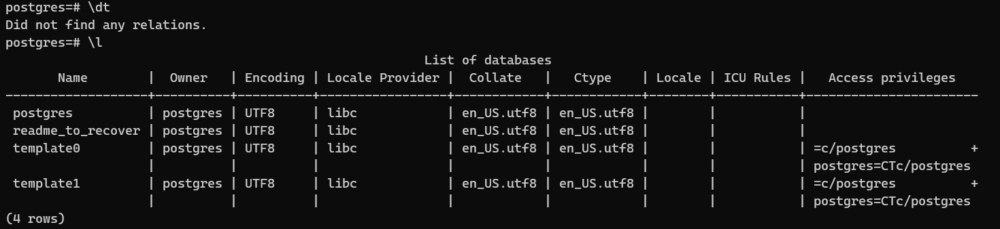
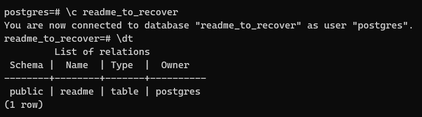
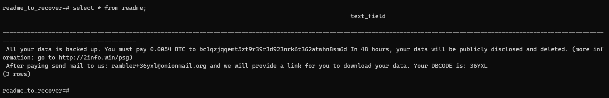

## Table of Contents

## Story

Recently, I have a project that need use docker to deploy. I use docker compose to host three service, one of them is postgres container.

After testing with Swagger to ensure api works correctly, i sent swagger docs to my team. But after a day, all the data disappeared. I had no idea what is going on. I have no experience, no doubt, just a litle wonder. Then, I just ssh to server and deployed again. Everythin works fine until this happened again.

This time, I decided to figure out why. I prompted GPT to give me some commands in postgres to check relations, database. I after doing `\l`, which lists all current database in postgres, I found this:

Myself like: what the heck. Then I selected this database `\c readme_to_recover` and `\dt` to check any relations. And voila!

I cannot wait. I was very excited. This is the content of this relation:

This is like i am being a bilianare, very very excited. 0.0053 BTC = 11,490,237.42 Vietnamese Dong at that time :)

## How I mitigate

First, I changed the default username and password of postgres db container. Then I removed the bind port line in docker compose. Finally, I delete this server instance and create a new one from Digital Ocean.

## What I learn

Experts would say I am stupid. Yes, but who cares. I have learned a lot from this experience. I want to write on here to remind myself.

-   Use secure password, always
-   Check port carefully when binding port in docker compose, as it will override the rule in ufw.
