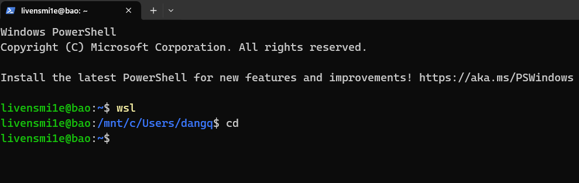

## Table of Contents

## Context

I have just reset my computer, so I need a way to control my storage. I found that temp files, and cache files during using go, yarn,... are main source of storage that always take 1 or 2 gigs per day. Having found that, I decided to learn a little bit of Powershell to automate the task.

## Imagination vs Reality

I imagined that the script I will create would be professional, with options, argument. After messing around, my finale script looks like this:

```bash
cl [-All]
```

Simple as that, the command clears temp files in `%TEMP%` folder by default, and skip any warning. If `-All` option specified, it cleans cache file of Go, Yarn, Python,...

## Learned

Most of the script is created by monica.im AI. I ask the AI to suggest and improvement, design pattern. It gived my the `command pattern` and `factory pattern`, which stores all the cache clearing commands for each language in a hashmap and enumerate over it.

I also learned about restart the powershell to takes effect using `. %profile`, some basic control syntax and cmdlets like `Get-Children, Remove-Item, Copy-Item`

## Styling

After finishing my initial plan, I want something more, some thing fancier. So I googled "How to make powershell looks like unix bash" and read the docs about customization.

You need to overwrite the `prompt` function in `%profile%` script.

```powershell
function prompt {
    $path = $ExecutionContext.SessionState.Path.CurrentLocation.Path
    $path = $path.Replace($HOME, "~").Replace("\", "/").toLower()
    $context = "livensmi1e@" + $env:COMPUTERNAME.toLower()
    Write-Host $context -NoNewline -ForegroundColor Green
    Write-Host ":" -NoNewline
    Write-Host $path -NoNewline -ForegroundColor Blue
    return "$ "
}
```

If we don't return `"$ "` and just write to host, then by default, powershell will return `"PS> "`. Now it looks almost exacly the unix bash.

Here is the result.



## Refs

-   [Powershell Prompt Docs](https://learn.microsoft.com/en-us/powershell/module/microsoft.powershell.core/about/about_prompts?view=powershell-7.5)
-   [Change your Powershell prompt to look like bash](https://yetanotherchris.dev/2017-02-23-change-your-powershell-prompt-to-look-like-bash/)
-   [Github Repository](https://github.com/livensmi1e/scripts/tree/main/powershell)
