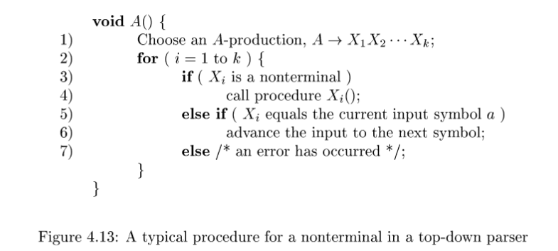

## Table of Contents

## Lexer

I wonder how to write a lexer. I know basic terminologies, there role in programming, but all of the behind the scene are blackbox to me. Fortunately, after searching for a while, I found this wonderful 3 part blog posts [Writing a Lexer and Parser in Go](https://adampresley.github.io/2015/05/12/writing-a-lexer-and-parser-in-go-part-2.html). And in the post, the author has mentioned a talk from Rob Pike. This talk is mind blowing, it gives me insight, how genenal lexer works. And also in this talk, he introduces new technique to implement lexer, in which he calls state function.

It took me 6 or 7 times to rewatch the video. Each time, I understanded something he says. Also I found the source code for the Go template system that he talks about. Shit, first time I can look at an pro open source code and understand it, although not completely.

The idea is that maintaining the state and action for the lexer, so the lexer does not lose information which it has just found about the current state (actually I don't clearly understand this line :D). So we use a state function, which capture the both state and do something on this state, then return the next expected state.

But first, we has to design our token structure. Here is one of theme

```go
type TokenType int

const (
	TOKEN_ERROR TokenType = iota
	TOKEN_EOF
	TOKEN_BEGIN_ARRAY
	TOKEN_END_ARRAY
	TOKEN_BEGIN_OBJECT
	TOKEN_END_OBJECT
	TOKEN_NAME_SEPARATOR
	TOKEN_VALUE_SEPARATOR
	TOKEN_NUMBER
	TOKEN_STRING
	TOKEN_TRUE_LITERAL
	TOKEN_FALSE_LITERAL
	TOKEN_NULL_LITERAL
)

type Token struct {
	Type   TokenType
	Lexeme string
}
```

This is the lexer.

```go
type Lexer struct {
	name        string
	input       string
	initalState lexFn
	start       int
	pos         int
	width       int
	tokens      chan Token
}
```

And here are some important functions

```go
func (l *Lexer) Run() {
	defer close(l.tokens)
	for state := l.initalState; state != nil; {
		state = state(l)
	}
}

func (l *Lexer) NextToken() Token {
	return <-l.tokens
}

func (l *Lexer) emit(t TokenType) {
	l.tokens <- Token{Type: t, Lexeme: l.input[l.start:l.pos]}
	l.start = l.pos
}
```

-   `Run` is the entry point, which was called by parser to get things tokenized.
-   `NextToken` takes the next token from the channel.
-   `emit` will put the token the lexer has done lexing into channel.

Note that the lexer will only has 2 exported function, for which the parse will call it. The rest of its methods are unexported.

Because the json spec states that json first start by value, so our initial state will be lexValue

```go
func lexValue(l *Lexer) lexFn {
	for {
		switch {
		case strings.HasPrefix(l.posToEndInput(), BEGIN_ARRAY):
			return lexBeginArray
		case strings.HasPrefix(l.posToEndInput(), BEGIN_OBJECT):
			return lexBeginObject
		case strings.HasPrefix(l.posToEndInput(), TRUE_LITERAL):
			return lexTrueLiteral
		case strings.HasPrefix(l.posToEndInput(), FALSE_LITERAL):
			return lexFalseLiteral
		case strings.HasPrefix(l.posToEndInput(), NULL_LITERAL):
			return lexNullLiteral
		case strings.HasPrefix(l.posToEndInput(), VALUE_SEPARATOR):
			return lexValueSeparator
		case strings.HasPrefix(l.posToEndInput(), NAME_SEPARATOR):
			return lexNameSeparator
		case strings.HasPrefix(l.posToEndInput(), END_ARRAY):
			return lexEndArray
		case strings.HasPrefix(l.posToEndInput(), END_OBJECT):
			return lexEndObject
		}
		switch r := l.next(); {
		case r == EOF:
			l.emit(TOKEN_EOF)
			return nil
		case unicode.IsSpace(r):
			l.ignore()
		case r == '-' || ('0' <= r && r <= '9'):
			l.backup()
			return lexNumber
		case r == '"':
			return lexString
		default:
			return l.errorf("unexpected character: %q", r)
		}
	}
}
```

It just looks at the current input from position to end and based on the current rune (character), decide which state function to process it.

For example, if it found the current rune is `{`, the lexer expect that this must be an begin array, so it call `lexBeginArray`

```go
func lexBeginArray(l *Lexer) lexFn {
	l.pos += len(BEGIN_ARRAY)
	l.emit(TOKEN_BEGIN_ARRAY)
	return lexValue
}
```

And if it sees the rune is a digit, it expects that this must be number, so it calls `lexNumber`. This function was hard for me. But with the help of gpt, I managed to make it works. First we will look at the json grammar for number:

```
number = [ minus ] int [ frac ] [ exp ]

         decimal-point = %x2E       ; .

         digit1-9 = %x31-39         ; 1-9

         e = %x65 / %x45            ; e E

         exp = e [ minus / plus ] 1*DIGIT

         frac = decimal-point 1*DIGIT

int = zero / ( digit1-9 *DIGIT )

minus = %x2D               ; -

plus = %x2B                ; +

zero = %x30                ; 0
```

```go
func lexNumber(l *Lexer) lexFn {
	l.accept("-")
	digit1_9 := "123456789"
	digit0_9 := "012345678"
	if l.accept("0") {

	} else if l.accept(digit1_9) {
		l.acceptRun(digit0_9)
	} else {
		return l.errorf("bad number syntax %q", l.input[l.start:l.pos])
	}
	if l.accept(".") {
		if !l.accept(digit0_9) {
			return l.errorf("bad number syntax %q", l.input[l.start:l.pos])
		}
		l.acceptRun(digit0_9)
	}
	if l.accept("Ee") {
		l.accept("+-")
		if !l.accept(digit0_9) {
			return l.errorf("bad number syntax %q", l.input[l.start:l.pos])
		}
		l.acceptRun(digit0_9)
	}
	l.emit(TOKEN_NUMBER)
	return lexValue
}
```

The `accept` function jsut comsumes the charactor if the input has that charactor. If not, nothing happens and return false. The `acceptRun` comsumes as many as the characters from the input. If it found rune that cannot accept, it just return.

So the idea is first, comsume `-` if it has any. Then try to comsume the int part. For the optional part, we can check if it has the sign of it, like the fraction with sign `.` and the exponent with sign `Ee`. If it has, we comsume the rest if fraction or exponent. Then emit the token and return basic state.

Because everything except 6 structural characters in json is value, so we return `lexValue`.

## Parser

This also a chanllenging part. I had to read the Dragon book, found some ideas, prompt gpt, found related posts.

And yay, in the Dragon book, I found an simple (insufficient) algorithm called `recursive descent parsing`. It works in top down manner. To understand it, we has to understand context free grammar.



Finally, this is my parser

```go
type Parser struct {
	lex      *lexer.Lexer
	curToken lexer.Token
	error    error
}
```

Again, the grammar says that (in my rewritten anltr4)

```
json: value;

value: object | array | NUMBER | STRING | TRUE | FALSE | NULL;

object: '{' (member (VALUE_SEPARATOR member)*)? '}' | '{' '}';

member: STRING NAME_SEPARATOR value;

array: '[' (value (VALUE_SEPARATOR value)*)? ']' | '[' ']';
```

Applying the algo is difficult, but yeah, this is it.

```go
func (p *Parser) parseValue() Value {
	if p.hasError() {
		return nil
	}
	switch p.curToken.Type {
	case lexer.TOKEN_BEGIN_OBJECT:
		p.nextToken()
		return p.parseObject()
	case lexer.TOKEN_BEGIN_ARRAY:
		p.nextToken()
		return p.parseArray()
	case lexer.TOKEN_STRING:
		s := String{Literal: p.curToken.Lexeme}
		p.nextToken()
		return s
	case lexer.TOKEN_NUMBER:
		v, _ := strconv.ParseFloat(p.curToken.Lexeme, 64)
		n := Number{Value: v}
		p.nextToken()
		return n
	case lexer.TOKEN_TRUE_LITERAL, lexer.TOKEN_FALSE_LITERAL:
		v, _ := strconv.ParseBool(p.curToken.Lexeme)
		b := Boolean{Value: v}
		p.nextToken()
		return b
	case lexer.TOKEN_NULL_LITERAL:
		p.nextToken()
		return Null{}
	default:
		p.error = fmt.Errorf("unexpected token: %s", p.curToken.String())
		return nil
	}
}
```

But if we look at it, we note that the function kinds of different from the algo. Because, in this case, we know exacly what to expect, we don't have to choose randomly each production rule, and the grammar for value contains many alternatives, not just one rule. (check again)

## Test

In this project, I also learn go testing. Just write the function `TestXXXX` where XXXX is the package name and put in the file `xxxx_test.go`.

I learn the term `table-driven test`, which just manually create a table of testcases and run for each of this in a for loop.

Finally, we can run `go test internal/lexer/ -v`.

## Thought

I know this is incomplete, and is nothing compare to the programming world. But I am still proud of myself. There are so much to learn, just hope that I find joy and fun doing it. That is my ultimate goal.

## Reference

-   [Writing a Lexer and Parser in Go](https://adampresley.github.io/2015/05/12/writing-a-lexer-and-parser-in-go-part-2.html)
-   [Lexical Scanning in Go - Rob Pike](https://www.youtube.com/watch?v=HxaD_trXwRE)
-   [go.dev/src/text/template/parse/lex.go](https://go.dev/src/text/template/parse/lex.go)
-   [Building a JSON Parser and Query Tool with Go](https://medium.com/@bradford_hamilton/building-a-json-parser-and-query-tool-with-go-8790beee239a)
-   [Function Types in Go (golang)](https://jordanorelli.com/post/42369331748/function-types-in-go-golang)
