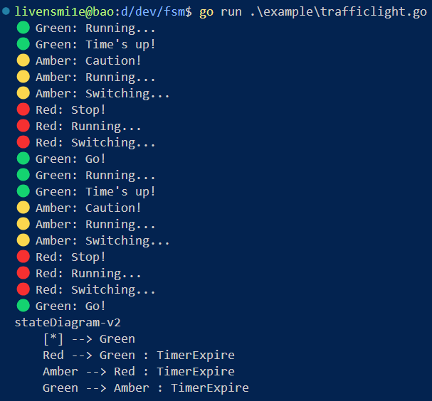

## Table of Contents

## Ideate

I want to build fsm that can be:

- General - can be used in any usecase
- Support state, transition rule, trigger event and most importantly callback function
- Expose clean public API
- Later on, as I read blogs, I want it can be visualized on tools like drawio, mermaid,...

## What I learned

This project is surprisingly short in time, I finished in just one day, not counting the idea day. The reason is there is one blog post that does most, very detailed, comprehensive and I just followed along.

I first need to imagine, try to understand how to design data structure for storing state and event. One common way is using map in go. But even using map, we also have more than one way to store it.

This is way for internal store.

```go
type state struct {
	transitions map[Event]State
}

type machine struct {
	name    string
	current State
	initial State
	states  map[State]state
	err     error
}
```

This is way for intermediate, pre proccess store.

```go
type Transition struct {
	Event Event
	Dst   State
}

type Transitions []Transition

type StateConfig struct {
	State       State
	Transitions Transitions
}

type States []StateConfig
```

It turns out that the latter is suitable for public API as it is straightforward.

To implement callbacks, instead of storing it in machines using map, we can let the state itself does that. Therefore, any state must implement these 3 methods.

```go
type State interface {
	OnEnter()
	OnExit()
	Execute()
}
```

One drawback is that we have fixed number of callbacks, we cannot define more callback for more stimuslus, like if state A to state B, the callback X will be called, if state C to state B, callback Y will be called. But I accept this.

The most important logic here are:

```go
func (m *machine) Transition(event Event) error {
	if m.err != nil {
		return m.err
	}
	next := m.getNextState(event)
	m.current.OnExit()
	m.current = next
	m.current.OnEnter()
	return nil
}

func (m *machine) getNextState(event Event) State {
	if m.err != nil {
		return nil
	}
	next, ok := m.states[m.current].transitions[event]
	if !ok {
		m.err = ErrEventDeclined
		return nil
	}
	return next
}
```

Also, I explore how to use builder pattern for nice, clean create function.

```go
type MachineBuilder struct {
	name     string
	initial  State
	states   map[State]state
	transMap map[State]map[Event]State
}

func NewMachineBuilder(name string) *MachineBuilder {
	return &MachineBuilder{
		name:     name,
		states:   make(map[State]state),
		transMap: make(map[State]map[Event]State),
	}
}

func (b *MachineBuilder) SetInitial(initial State) *MachineBuilder {
	b.initial = initial
	return b
}

func (b *MachineBuilder) AddState(add State) *MachineBuilder {
	b.states[add] = state{transitions: make(map[Event]State)}
	return b
}

func (b *MachineBuilder) AddTransition(src State, event Event, dst State) *MachineBuilder {
	if _, ok := b.transMap[src]; !ok {
		b.transMap[src] = make(map[Event]State)
	}
	b.transMap[src][event] = dst
	return b
}

func (b *MachineBuilder) Build() (Machine, error) {
	if _, ok := b.states[b.initial]; !ok {
		return nil, ErrInitialStateUndefined
	}
	for src, events := range b.transMap {
		if _, ok := b.states[src]; !ok {
			return nil, ErrStateUndefined
		}
		for event, dst := range events {
			if _, ok := b.states[dst]; !ok {
				return nil, ErrStateUndefined
			}
			b.states[src].transitions[event] = dst
		}
	}
	return &machine{
		name:    b.name,
		initial: b.initial,
		current: b.initial,
		states:  b.states,
	}, nil
}
```

I also have serious time reading mermaid docs on state diagram.

## Result

Voila, the machine works

|  |  |
| ---------------------------------------------------- | ----------------------------------------------------------- |

## Reference

- [Finite State Machines in Go -- Main reference](https://sebinbabu.com/posts/finite-state-machines-in-go/)
- [GFSM - A Simple and Fast FSM for Go](https://sysdev.me/gfsm-a-simple-and-fast-fsm-for-go/)
- [Errors are values](https://go.dev/blog/errors-are-values)
- [Golang Error Handling lesson by Rob Pike](https://jxck.hatenablog.com/entry/golang-error-handling-lesson-by-rob-pike)
- [Mermaid state diagram docs](https://mermaid.js.org/syntax/stateDiagram.html)
